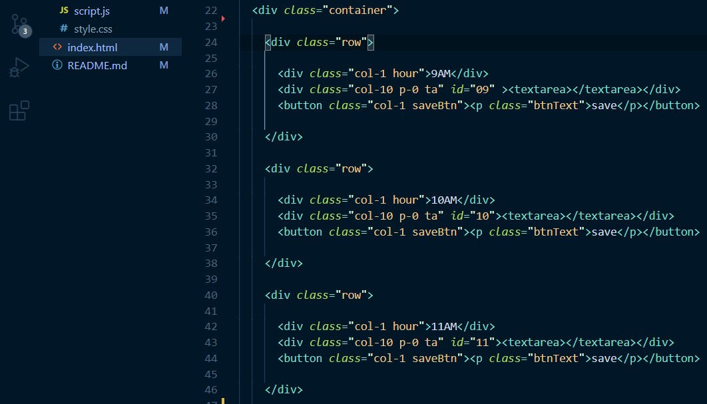

# Day-Planner

The reason for making this day planner was to create a website that would save and store your information for the day in the provided text areas. while doing this excersise I was able to flex the new knowledge that I have on the DOM as well as creating loops. 

# how it works 

The first thing that I accomplished was establishing the html, assigning it rows and columns for the time, text area and save button like so:

I gave each text area an id corilating to the time of the row it was on in military time. 