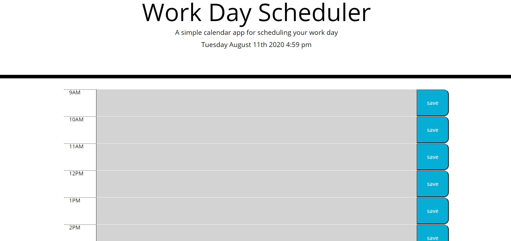
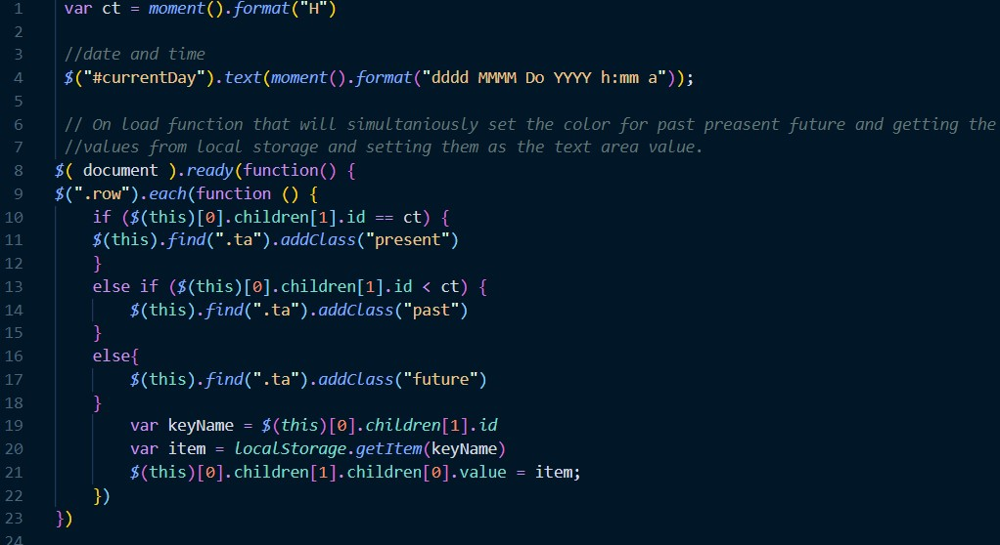

# Day-Planner

The reason for making this day planner was to create a website that would save and store your information for the day in the provided text areas. while doing this exercise I was able to flex the new knowledge that I have on the DOM as well as creating loops and functions. 

# How it works 

The first thing that I accomplished was establishing the HTML, assigning it rows and columns for the time, text area, and save button like so:

I gave each text area an id correlating to the time of the row it was on in military time. I also connected the necessary divs to the style sheet by assigning them specific classes that appeared on the CSS file.

Next in the javascript I created a variable for the current time (ct) and made it equal to moment().format("HH") which would allow the value to be changed as the hour did throughout the day. 

I also gave id currentDay the text value of (moment().format("dddd MMMM Do YYYY h:mm a")); which dynamically changed the date and time below the title.

After this, I created an on load function that would simultaneously set the color for past, present, and future while getting the 
values of past entries from local storage and setting them as the text area value.

I accomplished this as you can see above by enlisting a for each loop that iterated through the children of the different rows and checked to see if their ids were equal to the variable ct (time in military time). Which you can see in the first picture, I created an id for each text area to be equal a military time unique to its allotted column. If the id was found to be equal to ct then it was given the class ".preasent" which via the CSS would turn the background color red. Following suit if the id value was less than the ct value than the text box was given the class past, else, the text area was given the class of future.

Lastly, I created an event listener for the save buttons that would save the data entered into the text box to local storage.

This was accomplished using yet another for each loop. 

First I created an on-click listener for all of the button tags, then I created a new variable equal to the button clicked's 0th previous element sibling's 0th child's text value (the text that was typed into the text area). Following this, I created an "id" variable that would grab the id of the text box the same way through the DOM and therefore making the save button specific to its row.

Finally, I set the items to local storage where they will be kept until cleared through developer tools or deleted and saved off of the text box. 

Thank you for viewing my day planner project! I hoped you enjoyed my solution and continue to follow my progress as a jr full-stack web developer. 
